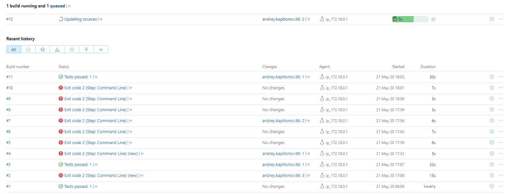

  
  <h1>Blog Chain</h1>
  <h5>App server written in Golang</h5>

### Deploy

- `make deploy`

### Docker

1. `make build`
2. `make run`

### Tests

1. `go tests`

#### For teamcity

1. `go tests -json`

### Migrations

0. before `make build-migration-tool`
1. `make migrate-new name={create_migration_name}`
2. `make migrate-up`, `make migrate-down`, `make migrate-status`

### CI/CD

